# RecipeWebsite

Discover a world of sweet recipes from all the world , satisfy your appetite with our Django-based website that we can offers.Share your recipes with other people , edit or delete if you don't like.Copy the recipes and use for your personal purposes.Resgister your account in few steps and be ready to join the sweet recipes family.This site is not for profit.

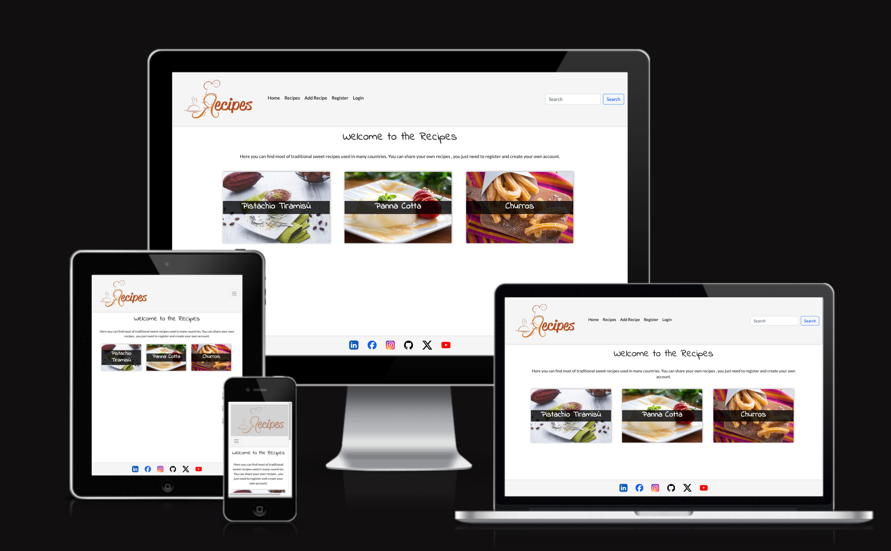

[View RecipeWebsite live website here](https://recipewebsite-1d6b244bd06e.herokuapp.com/)
- - -

## Table of Contents
### [User Experience](#user-experience-ux)
* [Project Purpose](#project-purpose)
* [Agile Methodology](#agile-methodology)
* [First time user](#first-time-user)
* [Registered user](#registered-user)
* [Admin user](#admin-user)
### [Design](#design-1)
* [Color Scheme](#color-scheme)
* [Cabin Images](#cabin-images)
* [Wireframes](#wireframes)
* [Data Model](#data-models)
* [User Journey](#user-journey)
* [Database Scheme](#database-scheme)
### [Features](#features-1)
* [Existing Features](#existing-features)
* [Features Left to Implement](#features-left-to-implement)
### [Technologies Used](#technologies-used-1)
* [Languages](#languages)
* [Tools](#tools)
* [Frameworks](#frameworks)
* [Libraries and modules](#libraries-and-modules)
### [Deployment](#deployment-1)
* [Local Developement](#local-developement)
* [CI PostgreSQL Database](#ci-postgresql-database)
* [Cloudinary](#cloudinary)
* [Heroku Deployment](#heroku-deployment)
### [Testing](#testing-1)
* [Validator Testing](#validator-testing)
* [Lighthouse Test](#lighthouse-test)
* [Manual Testing](#manual-testing)
### [References](#references-1)
* [Docs](#docs)
* [Content](#content)
* [Acknowledgments](#acknowledgments)

---

## User Experience UX

### Project Purpose

Recipes is a site where the user can create, modify and delete recipes created or taken from any other source. The purpose of this project is to connect users who have a passion for cooking and also users who are approaching this sector for the first time taking inspiration from the recipes from these same. Create a small community where users can interact with each other. Users can easily navigate to the different pages of the website with the navigation menu at the top. The navigation menu contains a logo which takes the user to the home page if they click on it and has five menus: Home, Recipes, Add Recipe, Register and LogIn.If a user is registered and logged in, instead of Register and LogIn there will be Profile and LogOut.

### Agile Methodology

I used an Agile methodology approach to plan this project. This was implemented through the GitHub Project board.
Each user story was classified with a label according to MoSCoW prioritization. 
The Kanban board can be seen [here](https://github.com/users/t0tacci0/projects/7).

### First Time User

 - As a first time user, I want to find out what the website offers.
 - As a first time user, I want to navigate easy through the different menus.
 - As a first time user, I want to find the links to other social media platform where I can find and search the recipes through other platforms.
 - As a first time user, I want to be able to join the website so I easy can find new/saved recipes.
 - As a first time user, I want to be able to join the website so I can write my own recipes.
 - As a first time user, I want to be able to find on search bar keywords recipes.

### Registered User

  - As a registered user, I want to log in and see saved/created recipes.
  - As a registered user, I want to see if the website is updated with new recipes from other users.
  - As a registered user, I want to be able to add,update or delete my recipes.

### Admin User

 - As a admin user, I am able to change or delete users and profiles.
 - As a admin user, I am able to change Authentication and Authorization users.
 - As a admin user, I am able to delete or change recipes.

----

## Technologies Used

### Languages:
- [HTML5](https://en.wikipedia.org/wiki/HTML5)
- [CSS](https://en.wikipedia.org/wiki/CSS)
- [JavaScript](https://www.javascript.com/)
- [Python](https://en.wikipedia.org/wiki/Python_(programming_language))

### Tools:
- [Git](https://git-scm.com/) Used for version control by utilizing the Gitpod terminal to commit to Git and Push to GitHub.
- [GitHub](https://github.com/) Used to save and store the files for the website.
- [Heroku](https://www.heroku.com) Used to deploy the application.
- [VS Code](https://code.visualstudio.com/) Used as IDE. 
- [Code Insitute Database Maker](https://dbs.ci-dbs.net/) PostgreSQL database hosting for this project.
- [Fontawesome](https://fontawesome.com/) Used to add icons to the website.
- [Balsamiq](https://balsamiq.com/) Used to create the wireframes.
- [Coloors](https://coolors.co/image-picker) Used to create the colour scheme.
- [Cloudinary](https://cloudinary.com/) Used to store the item images.
- [Canva](https://www.canva.com/) Used to create the logo.
- [Favicon.io](https://favicon.io/favicon-generator/) Used to create the favicon.
- [Google Chrome Dev Tools](https://developer.chrome.com/docs/devtools?hl=de) Used to check the application for responsiveness and errors.

### Frameworks: 
- [Bootstrap](https://getbootstrap.com/) 
- [Django](https://en.wikipedia.org/wiki/Django_(web_framework))
- [jquery](https://jquery.com/)

### Libraries and modules:
- [os](https://docs.python.org/3/library/os.html) Provides functions to interact with the operating system. 
- [sys](https://docs.python.org/3/library/sys.html) Used to get system-specific functions.
- [datetime](https://docs.python.org/3/library/time.html) Supplies classes for manipulating dates and times.
- [Gunicorn](https://gunicorn.org/) Provides a way to serve Python web applications.
- [Pycopg 2](https://pypi.org/project/psycopg2/) PostgreSQL database adapter for Python.
- [Allauth](https://docs.allauth.org/en/latest/) Used to handle user authentication, registration, and account management.
- [Crispy Forms](https://django-crispy-forms.readthedocs.io/en/latest/) Django application to manage and to render the forms.
- [Whitenoise](https://whitenoise.readthedocs.io/en/stable/) Used to serve static files.
- [dj_database_url](https://pypi.org/project/dj-database-url/) Enables the ability to represent their database settings via a string.

----

## Deployment

Live deployment can be found on this [View RecipeWebsite live here](https://recipewebsite-1d6b244bd06e.herokuapp.com/)

### Local Developement

 1. Generate an env.py file in the root directory of the project
 2. Configure the environment variables within this file.
 3. Create a virtual environment
 4. Install all required dependencies using _pip install_ command into the .venv
 5. Add dependencies to the requirements.txt file using _pip3 freeze > requirements.txt_ command

#### How to Fork
1. Log in(or Sign Up) to Github
2. Go to repository for this project [RecipeWebsite](https://github.com/t0tacci0/RecipeWebsite)
3. Click the fork button in the top right corner

#### How to Clone
1. Log in(or Sign Up) to Github
2. Go to repository for this project [RecipeWebsite](https://github.com/t0tacci0/RecipeWebsite)
3. Click on the code button, select whether you would like to clone with HTTPS, SSH or GitHub CLI and copy the link shown.
4. Open the terminal in your code editor and change the current working directory to the location you want to use for the cloned directory.
5. Type the following command in the terminal (after the git clone you will need to paste the link you copied in step 3 above)
6. Set up a virtual environment (this step is not required if you are using the Code Institute Template in GitPod as this will already be set up for you).
7. Install the packages from the requirements.txt file - run Command pip3 install -r requirements.txt

### CI PostgreSQL Database
[RecipeWebsite](https://github.com/t0tacci0/RecipeWebsite) is using [CI PostgreSQL]() CI PostgreSQL Database

1. Create a new file named "env.py" in your IDE root directory, the same as your Procfile.
2. Open the ".gitignore" file and add the "env.py".
3. Open your "env.py" file and add this text: "import os os.environ.setdefault('DATABASE_URL', '')".
4. Change the text "" to your own data base URL you copied from CI PostgreSQL.
5. Pip install dj-database-url~=0.5 and psycopg2~=2.9, these are required to be able to connect to your PostgresSQL database.
6. Pip freeze your requirements.txt file.
7. Open your "settings.py" and add this "import os    import dj_database_url if os.path.isfile('env.py'): import env".
8. Still in your "settings.py" file, find the local sqlite3 database that Django provides and comment that one out so you dont use it.
9. Then add this text under the local database you just commented out "DATABASES = { 'default': dj_database_url.parse(os.environ.get("DATABASE_URL")) }".
10. Now that your project is connected to the database you need to use the migrate command in your terminal, copy this text to your terminal and press enter "python manage.py migrate".
11. In your "settings.py" file change DEBUG to False! IMPORTANT.
12. Now git add, commit and push all the changes to Github.
13. Go to your Heroku dashboard and go to the DEPLOY tab and do a manual deployment.
14. When the deployment is done go to the settings tab and reveal your config vars.
15. Add a new config var with the KEY "DATABASE_URL" and the VALUE is your CI PostgreSQL URL.
16. Now your deployed app should be connected to your new CI PostgresSQL database.

### Cloudinary
[RecipeWebsite](https://github.com/t0tacci0/RecipeWebsite) is using [Cloudinary](https://cloudinary.com/)
1. For Primary interest, you can choose Programmable Media for image and video API.
2. Optional: edit your assigned cloud name to something more memorable.
3. On your Cloudinary Dashboard, you can copy your API Environment Variable.
4. Be sure to remove the CLOUDINARY_URL= as part of the API value; this is the key.

### Heroku Deployment
* Log into [Heroku](https://www.heroku.com/) account or create an account.
* Click the "New" button at the top right corner and select "Create New App".
* Enter a unique application name
* Select your region
* Click "Create App"

#### Prepare enviroment and settings.py
* In your GitPod workspace, create an env.py file in the main directory.
* Add the DATABASE_URL value and your chosen SECRET_KEY value to the env.py file.
* Update the settings.py file to import the env.py file and add the SECRETKEY and DATABASE_URL file paths.
* Comment out the default database configuration.
* Save all files and make migrations.
* Add the Cloudinary URL to env.py
* Add the Cloudinary libraries to the list of installed apps.
* Add the STATIC files settings - the url, storage path, directory path, root path, media url and default file storage path.
* Link the file to the templates directory in Heroku.
* Change the templates directory to TEMPLATES_DIR
* Add Heroku to the ALLOWED_HOSTS list the format ['app_name.heroku.com', 'localhost']

#### Add the following Config Vars in Heroku:

* SECRET_KEY - This can be any Django random secret key
* CLOUDINARY_URL - Insert your own Cloudinary API key
* PORT = 8000
* DISABLE_COLLECTSTATIC = 1 - this is temporary, and can be removed for the final deployment
* DATABASE_URL - Insert your own database URL here

#### Heroku needs two additional files to deploy properly

* requirements.txt
* Procfile

#### Deploy

1. Make sure DEBUG = False in the settings.py
2. Go to the deploy tab on Heroku and connect to GitHub, then to the required repository.
3. Scroll to the bottom of the deploy page and either click Enable Automatic Deploys for automatic deploys or Deploy Branch to deploy manually. Manually deployed branches will need re-deploying each time the GitHub repository is updated.
4. Click 'Open App' to view the deployed live site.

Site is now live

## Testing

The app was tested regularly and deployed early to Heroku to make sure both local and remote worked the same.

### Validator Testing

 HTML Validation

 

All HTML pages were run through the [W3C HTML Validator](https://validator.w3.org/).  
  - result for 'home' page 
    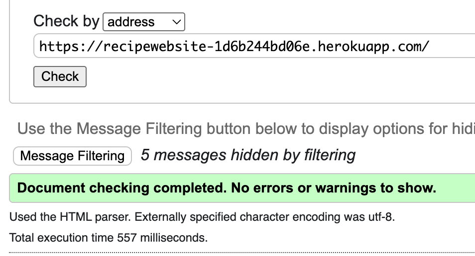 
  - result for 'Sign Up' page 
    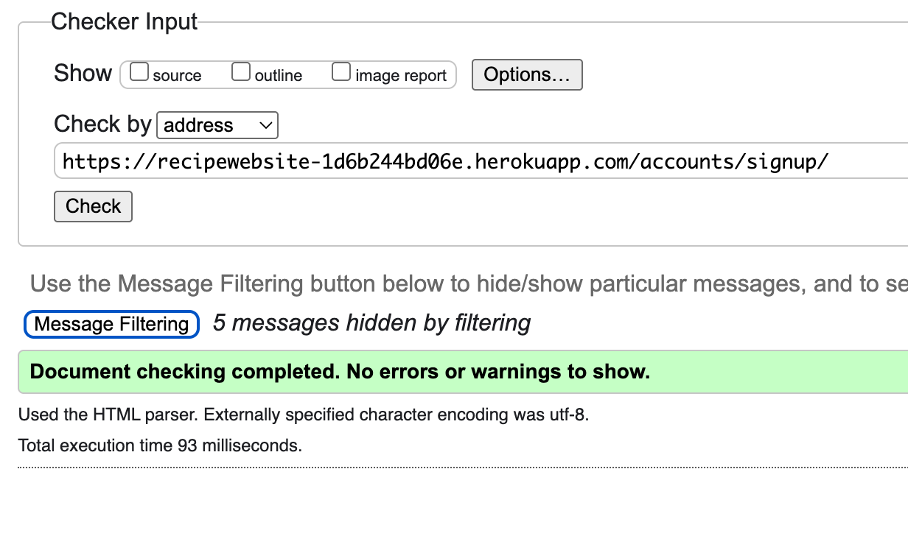 
  - result for 'Log In' page 
    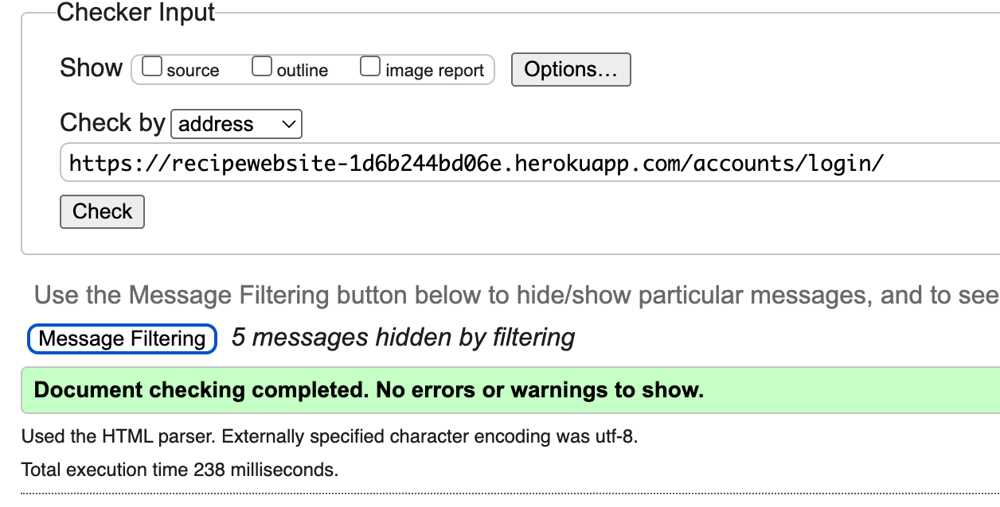  
  - result for 'Log Out' page 
    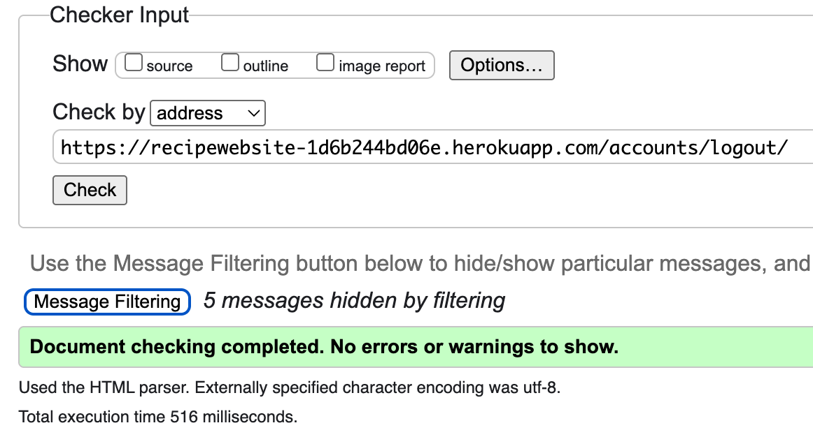 
  - result for 'Confirm Email' page 
    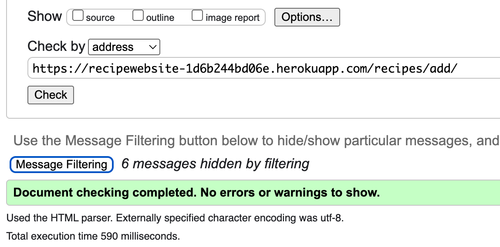  
  - result for 'Profile' page 
    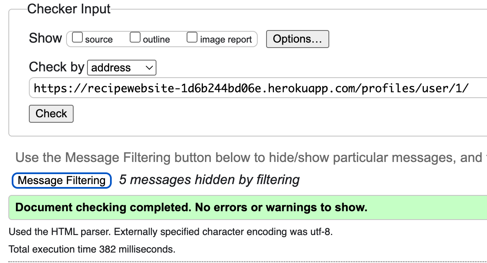 
  - result for 'Edit Profile' page 
    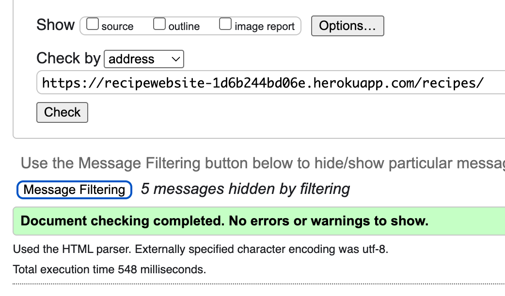 
   
  

 CSS Validation

 

I passed my css file through the [CSS Validator](https://jigsaw.w3.org/css-validator/) and no errors were found. 
     
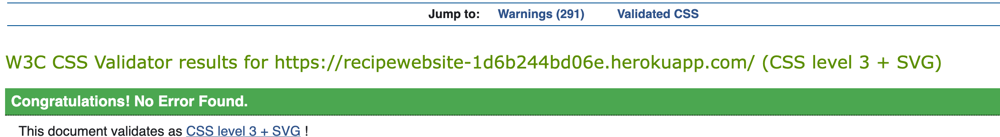
  

 Python Validation

 

All created python files were checked with the [Code Insitute validator - CI Python Linter](https://pep8ci.herokuapp.com/#). After removing some lines that were too long, everything was clear, and no errors were found. 
  

### Lighthouse Test
To measure the website against performance, accessibility, SEO and best practice, I used [Lighthouse](https://chromewebstore.google.com/detail/lighthouse/blipmdconlkpinefehnmjammfjpmpbjk?hl=de). 

 Results 

 

  - Home Page
  
  - Sign Up
  
  - Log In 
  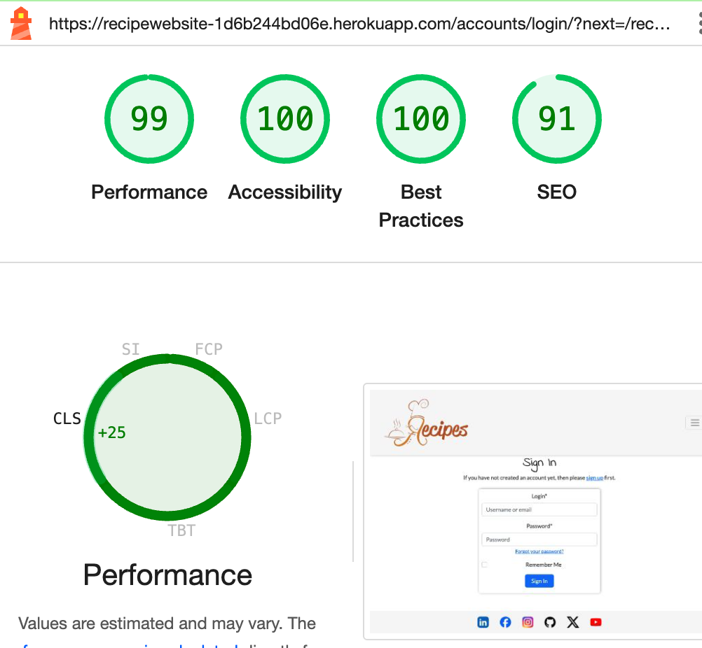
  - Log Out 
  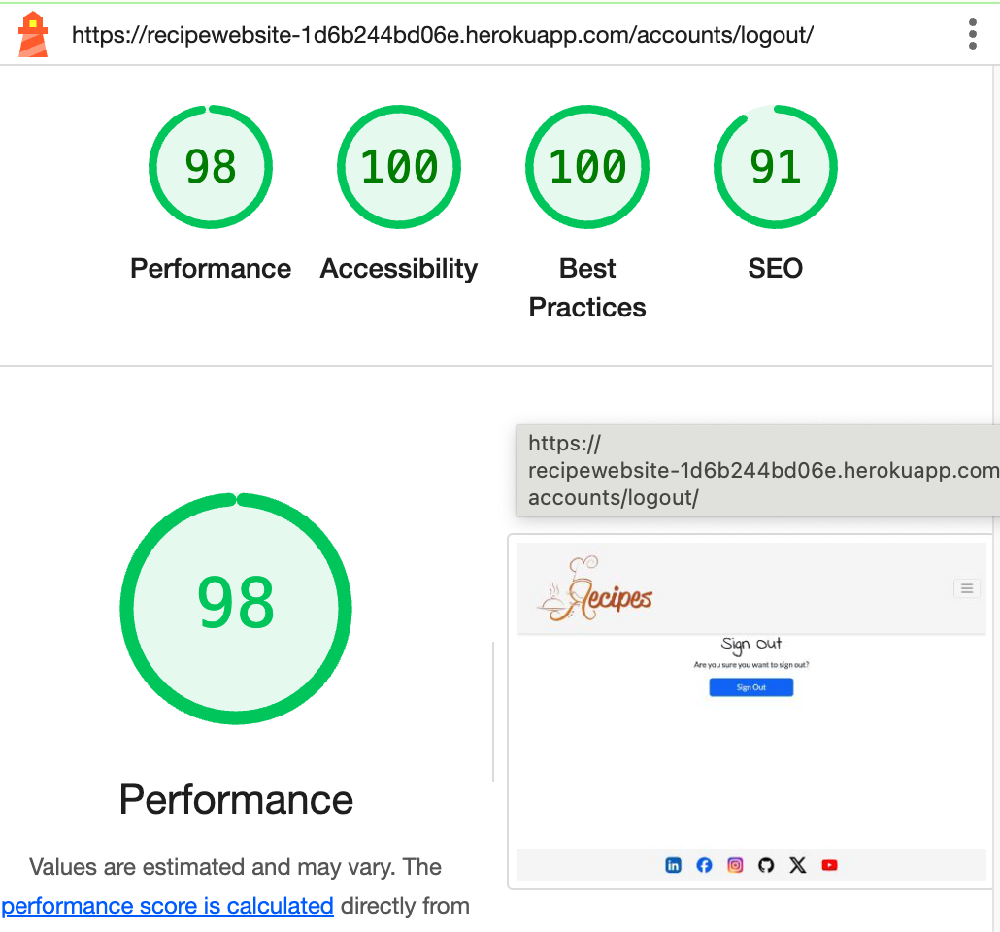
  - Verify your email 
  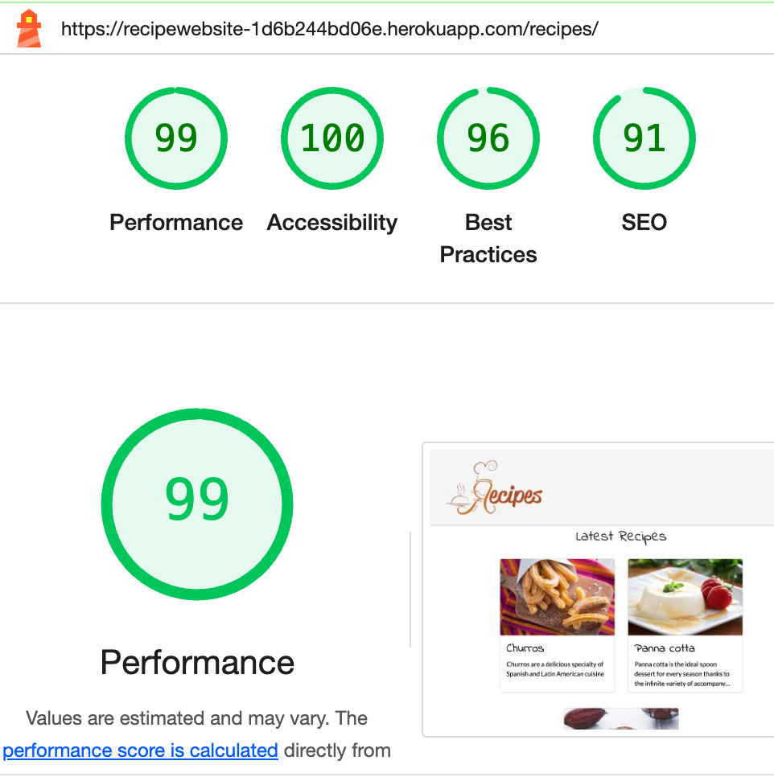
  - Profile Page 
  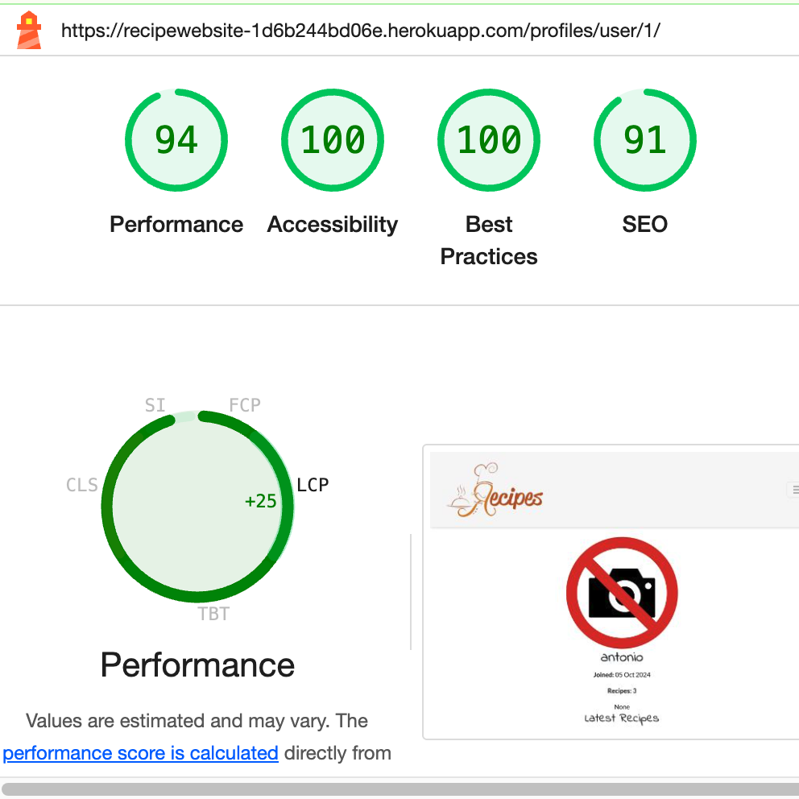
  - Edit Profile Page 
  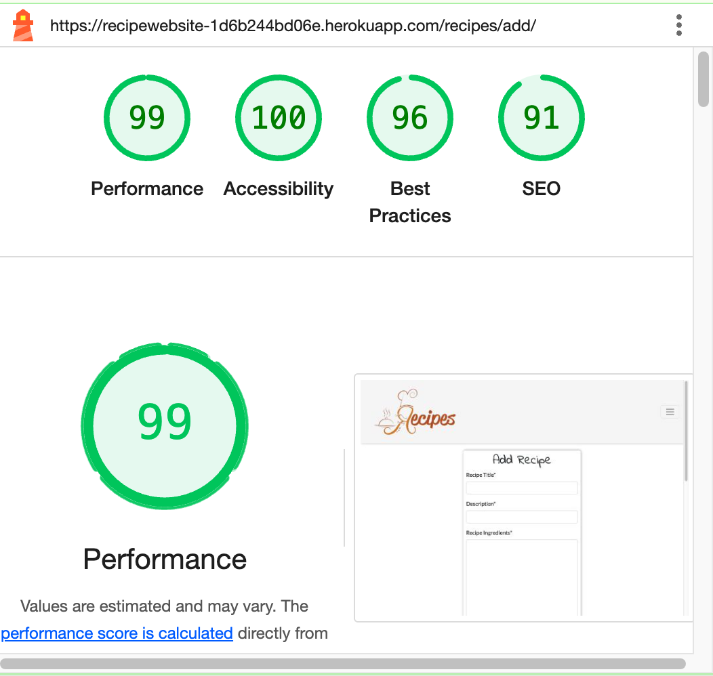
  

### Manual Testing

 Click here to see the testing table for features

 

| **Test** | **Test Description** | **Expected Outcome** | **Result** |
|:---|:---|:---|:---|
| Header - Logo | Click on the logo to return to main page | Clicking on the logo on each page will return you to the main page | Pass |
| Header - Navbar toggle in tablet/mobile view | Click in tablet/mobile view on the burger icon to open the navigation | When the burger icon in mobile or tablet view is clicked, the navigation should open | Pass |
| Header - Navigation underline | The page you are currently on should be underlined in the menu | After reaching a page at the application, the corresponding navigation item should be underlined | Pass |
| Header - Navigation link | Click on a term in the navigation bar to go to the corresponding page | Clicking on a page at the navigation bar should take the user to the corresponding page | Pass |
| Header - Navigation links and items | Depending on whether the user is logged in or not, the navigation elements should adapt accordingly | After logging in, the navigation menu should adjust accordingly. | Pass |
| Add recipe page - default version | Visit the website for the first time or don't be logged in to see the default version of the 'add recipe' page | After visiting the website for the first time or if a user isn't logged in, the main page should contain a signin form with the option to signup.  | Pass |
| Add recipe page - Log in version | Log in to see a modified version of the 'add recipe' page | After logging in, the 'add recipe' page should contain a form list to create recipe. | Pass |
| Sign Up | Fill out each field and click on the sign-up button. | After filling out every form field with validate input, and clicking the 'Sign Up' button, the user should be logged in. | Pass |
| Log In | Log in with username and password | Clicking on the 'Log In' button after providing the correct username and password, the user should be redirected to the main page in the log in version. In addition, a message that a successful login has taken place should be displayed. | Pass |
| Log out | Click 'Logout' in the navigation bar | After clicking on Logout, a new page should open in which the user is asked whether they really want to log out. When the logout button is clicked again, the user is redirected to the default home page and a message is displayed. | Pass |
| User profile Overview - Log in required | Navigate to the profile page to see profile data | The profile page should show an overview of the data given | pass |
| 'Add recipe' page - Log in required | Click in the navigation bar on the link 'add recipe' to get to the 'Add recipe' page | After the user clicks on the link, he gets to the corresponding page 'Add recipe'. | Pass |
| Recipes | log in required | Click on the recipe to get to the selected recipe | The user should see all the different recipes when first visiting the recipes page.The user should be taken to the correct recipe when clicking on one of the recipes. | Pass |
| Edit recipes | log in required | Click on the recipe detail page to make changes.If the user has made that recipe should be able to edit/delete that recipe. | The user should see the correct recipe with all the information about. The user should be able to edit/delete the recipe made. | Pass |
| Header - search bar | Click on the search bar to find recipes | Clicking on the search bar user can find recipes.If no recipes are found the bar shows no recipes with white page.| Pass |
| Admin panel - superuser required | Navigate to the home page of the application and append /admin to it | As superuser, the admin panel should appear | Pass |
| Admin panel - Login as superuser - superuser required | Access the admin login page, enter a valid superuser username and password, click the "Log in" button | The admin dashboard is displayed | Pass |
| Admin panel - Try to access the admin area without superuser privileges - superuser required | Log in as a regular user, access the admin URL by adding /admin to the homepage URL | An error message is displayed indicating insufficient permissions, and the user cannot access the admin dashboard | Pass |
| Admin panel - Manage user accounts - superuser required | Log in as a superuser, navigate to the user management section, add a new user, edit an existing user, delete a user. | The user accounts are correctly added, edited, and deleted, with changes reflected in the database. | Pass |
| Admin panel - Manage recipes - superuser required | Log in as a superuser, navigate to the recipes section, add a new recipe, edit or delete an existing one. | The recipes are correctly added, edited, and deleted, with changes reflected in the database. | Pass |
| Responsiveness | Access the _RecipeWebsite_ pages using a desktop browser, resize the browser window to simulate different screen sizes (e.g., mobile, tablet), and refresh the pages as needed | The page layout adjusts smoothly and remains usable without horizontal scrolling, ensuring all content (cards, buttons, text) is displayed appropriately for each screen size. | Pass |

### Browser Compatibility
  The tests were conducted using the following browser:

- Google Chrome Version 126.0.6478.126  
Tests were also carried out for the following browsers using [browserling](https://www.browserling.com/)  
- Edge Version 122
- Firefox 124
- Opera 108

## References
### Docs

* [Stack Overflow](https://stackoverflow.com/)
* [Code Institute](https://learn.codeinstitute.net/dashboard)
* [Bootstrap 4.6](https://getbootstrap.com/docs/4.6/getting-started/introduction/)
* [Django flash messages](https://www.pythontutorial.net/django-tutorial/django-flash-messages/)
* [Django docs](https://docs.djangoproject.com/en/4.2/releases/3.2/)
* [Django and Static Assets](https://devcenter.heroku.com/articles/django-assets)
* [Cloudinary](https://cloudinary.com/documentation/diagnosing_error_codes_tutorial)
* [Google](https://www.google.com/)
* [Heroku deployment](https://devcenter.heroku.com/categories/deployment)
* [Reddit](https://www.reddit.com/)
* [W3schools](https://www.w3schools.com/)

### Content

* All of the content is imaginary and written by the developer Antonio C.

### Acknowledgments

* I would like to thank my mentor for support and feedback throughout this project , Mitko Bachvarov.
* I would also to thank the Slack community for their continuous engagement and willingness to share knowledge. The collaborative environment provided a platform for learning, troubleshooting, and gaining inspiration from fellow developers.